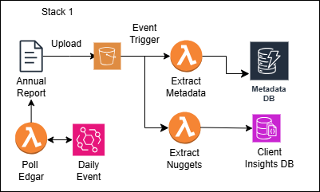

# Maxit Bot

This is the repo for Maxit Sales bot. 

Stack 1: 



Order of build: 

1. S3 bucket set-up (tag: maxit)
``` 
aws s3api create-bucket --bucket maxit-bot-annualreports --region us-east-2 
aws s3api put-bucket-tagging --bucket maxit-bot-annualreports --tagging 'TagSet=[{Key=project,Value=maxit}]'
```

2. DynamoDB set-up - Metadata DB (tag: maxit)

Table Design: AnnualReportsMetadata
Primary Key
    Partition Key (report_id) – A unique identifier for each report (e.g., CompanyX-2024-Q1).
    Sort Key (year) (Optional, if you want yearly retrievals) – Numeric year (e.g., 2024).
Composite GSI on company_name + year
    A GSI with company name as partition key and year as the sort key allows efficient sorting by year when querying.
    You can easily retrieve the latest report by sorting in descending order.

Table Schema
| Attribute Name       | Data Type   | Description |
|----------------------|------------|-------------|
| `report_id` *(PK)*  | String      | Unique ID for the report (e.g., `CompanyX-2024-Q1`). |
| `year` *(SK)*       | Number      | The year of the report (e.g., `2024`). |
| `company_name`      | String      | Name of the company the report belongs to. |
| `edgar_key`         | String      | The EDGAR unique key (CIK or Accession Number). |
| `s3_bucket`         | String      | Name of the S3 bucket (`maxit-bot-annualreports`). |
| `s3_key`            | String      | S3 object key (e.g., `reports/CompanyX/2024-Q1.pdf`). |
| `upload_timestamp`  | String      | Timestamp of when the file was uploaded (ISO 8601 format). |
| `file_size`         | Number      | File size in bytes. |
| `file_type`         | String      | MIME type of the report (e.g., `application/pdf`). |
| `tags` *(Optional)* | List<String> | Tags for easy categorization (e.g., `[“financial”, “Q1”]`). |
| `processed_status` *(Optional)* | String | Status of processing (`pending`, `processed`, `error`). |

```
aws dynamodb create-table \
    --table-name AnnualReportsMetadata \
    --attribute-definitions \
        AttributeName=report_id,AttributeType=S \
        AttributeName=year,AttributeType=N \
        AttributeName=company_name,AttributeType=S \
        AttributeName=edgar_key,AttributeType=S \
    --key-schema \
        AttributeName=report_id,KeyType=HASH \
        AttributeName=year,KeyType=RANGE \
    --billing-mode PAY_PER_REQUEST \
    --global-secondary-indexes \
        "[
            {
                \"IndexName\": \"CompanyYearIndex\",
                \"KeySchema\": [
                    {\"AttributeName\": \"company_name\", \"KeyType\": \"HASH\"},
                    {\"AttributeName\": \"year\", \"KeyType\": \"RANGE\"}
                ],
                \"Projection\": {\"ProjectionType\": \"ALL\"}
            }
        ]"
```


3. Lambda - Extract Metadata (tag: maxit)
4. Document DB - Client Insights DB (tag: maxit)
5. Lambda - Extract client insights (tag: maxit)
6. Lambda - Poll Edgar (tag: maxit)
7. Event bridge set-up to trigger "Lambda - Poll Edgar" daily 


